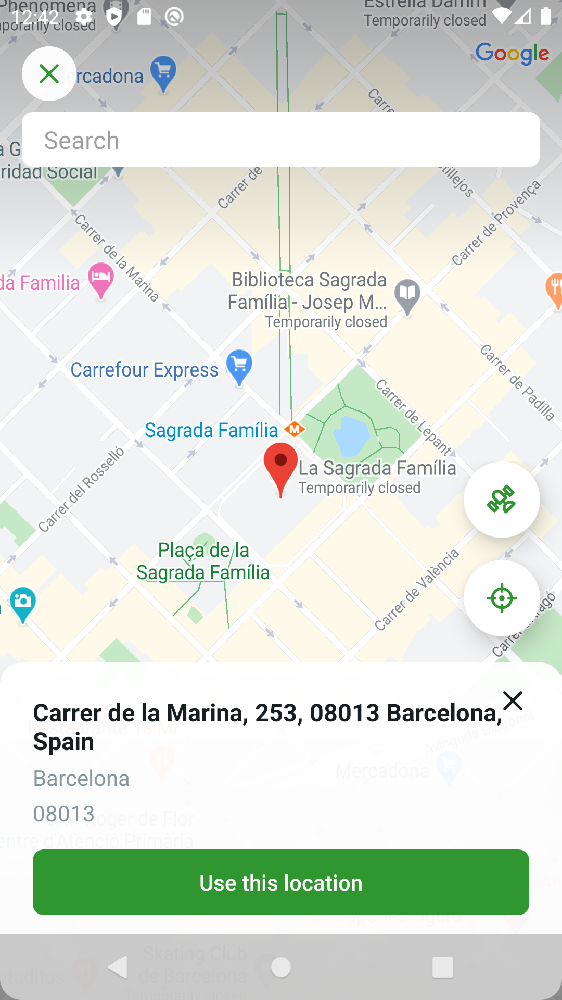

<!--
  Title: Leku Multiplatform - Map location picker for Android and iOS
  Description: Maps library for Android/iOS that returns a latitude, longitude and an address based on the location picked with the component provided.
  Author: Ferran Pons
  -->


<div style="display:block; height: 168px;">
* <i>The location Picker for Android an iOS</i> *

Component library for Android and iOS that uses Google Maps and returns a latitude, longitude and an address based on the location picked with the component provided.
</div>

<br/>
<p align="center">
<b><a href="#features">Features</a></b>
|
<b><a href="#download">Download</a></b>
|
<b><a href="#permissions">Permissions</a></b>
|
<b><a href="#usage">Usage</a></b>
|
<b><a href="#localization">Localization</a></b>
|
<b><a href="#customization">Customization</a></b>
|
<b><a href="#tracking">Tracking</a></b>
|
<b><a href="#extra">Extra</a></b>
|
<b><a href="#who-made-this">Who Made This</a></b>
|
<b><a href="#apps-using-leku">Apps using Leku</a></b>
|
<b><a href="#contribute">Contribute</a></b>
|
<b><a href="#bugs-and-feedback">Bugs and Feedback</a></b>
|
<b><a href="#license">License</a></b>
</p>
<br/>

### Features




* Search by voice
* Search by text
* Geo Location by GPS, network
* Google Places (optional)
* Google Time Zone API (optional)
* Pick locations using "touch" gestures on the map
* Customization (Theme and layout)
* Events Tracking
* Multi-language support (English, Spanish and Vietnamese supported by default)
* RTL (Right-To-Left) layout support
  <br><br><br>


### Prerequisites

### Download


##### Troubleshoot


### Permissions


### Usage


#### Google Places


#### Localization

If you would like to add more language translations the only thing you have to do is:

1. Crate a new strings resource folder and file for your language like "/values-ru".
2. Add all text translations for those strings:

```xml
<string name="leku_title_activity_location_picker">Location Picker</string>
<string name="leku_load_location_error">Something went wrong. Please try again.</string>
<string name="leku_no_search_results">There are no results for your search</string>
<string name="leku_unknown_location">unknown location</string>
<string name="leku_voice_search_promp">Search by voice…</string>
<string name="leku_voice_search_extra_language">en-EN</string>
<string name="leku_toolbar_action_voice_title">Voice</string>
<string name="leku_search_hint">Search</string>
```

Note that you have the **voice_search_extra_language** that is used for the language of the voice recognition.
Replace it with the allowed voice recognition locale for your language.

We encourage you to add these languages to this component, please fork this project and submit new languages with a PR. Thanks!


#### Customization

##### Theming

This library uses material components, so should use Theme.MaterialComponents or descendant in manifest.

```xml
<item name="colorPrimary">#E91E63</item>
<item name="colorPrimaryDark">#C51162</item>
<item name="colorAccent">#FBC02D</item>
<item name="colorControlActivated">#E91E63</item>
```

> `colorControlActivated` is used to colorize Street title, if not set, it uses colorAccent by default

##### New activity images and button color customization

If you need to change theme colors for new activity map, you can do it with the below keys:

```xml
<color name="leku_ic_close">#000000</color>
<color name="leku_ic_gps">#000000</color>
<color name="leku_ic_satellite">#000000</color>
<color name="leku_ic_maps">#000000</color>
<color name="leku_location_accept_button_bg">#000000</color>
```

To customize map, use:

```kotlin
.withMapStyle(R.raw.map_style_retro)
```

> Theme creator here: https://mapstyle.withgoogle.com/

##### Layout

It's possible to hide or show some of the information shown after selecting a location.
Using tha bundle parameter **LocationPickerActivity.LAYOUTS_TO_HIDE** you can change the visibility of the street, city or the zipcode.

```kotlin
intent.putExtra(LocationPickerActivity.LAYOUTS_TO_HIDE, "street|city|zipcode")
```

##### Search Zone

By default the search will be restricted to a zone determined by your default locale. If you want to force the search zone you can do it by adding this line with the locale preferred:

```kotlin
intent.putExtra(LocationPickerActivity.SEARCH_ZONE, "es_ES")
```

##### Search Zone Rect

If you want to force the search zone you can do it by adding this line with the lower left and upper right rect locations:

```kotlin
intent.putExtra(LocationPickerActivity.SEARCH_ZONE_RECT, SearchZoneRect(LatLng(26.525467, -18.910366), LatLng(43.906271, 5.394197)))
```

##### Default Search Zone Locale

If you want to be able to search with the default device locale, you can do it by adding this line:

```kotlin
intent.putExtra(LocationPickerActivity.SEARCH_ZONE_DEFAULT_LOCALE, true)
```

Note: If you don't specify any search zone it will not search using any default search zone. It will search on all around the world.

##### Force return location on back pressed

If you want to force that when the user clicks on back button it returns the location you can use this parameter (note: is only enabled if you don't provide a location):

```kotlin
intent.putExtra(LocationPickerActivity.BACK_PRESSED_RETURN_OK, true)
```

##### Enable/Disable the Satellite view

If you want to disable the satellite view button you can use this parameter (note: the satellite view is enabled by default):

```kotlin
intent.putExtra(LocationPickerActivity.ENABLE_SATELLITE_VIEW, false)
```

##### Enable/Disable requesting location permissions

If you want to disable asking for location permissions (and prevent any location requests)

```kotlin
intent.putExtra(LocationPickerActivity.ENABLE_LOCATION_PERMISSION_REQUEST, false)
```

##### Enable/Disable voice search

Now you can hide the voice search option on the search view

```kotlin
intent.putExtra(LocationPickerActivity.ENABLE_VOICE_SEARCH, false)
```

##### Hide/Show "Unnamed Road" on Address view

Now you can hide or show the text returned by the google service with "Unnamed Road" when no road name available

```kotlin
intent.putExtra(LocationPickerActivity.UNNAMED_ROAD_VISIBILITY, false)
```

##### Hide/Show the Search Bar

Now you can hide or show the search bar that helps you to search for locations

```kotlin
intent.putExtra(LocationPickerActivity.SEARCH_BAR_HIDDEN, false)
```

##### Custom Autocomplete Results Adapter

You can define your custom autocomplete results adapter.

```kotlin
class SearchViewHolder(
  val textView: TextView,
) : LekuViewHolder(textView)

class CustomLocationsAdapter : SuggestSearchAdapter<SearchViewHolder>() {
  override fun onCreateViewHolder(
    parent: ViewGroup,
    viewType: Int
  ): SearchViewHolder {
    val view = LayoutInflater
      .from(parent.context)
      .inflate(
        R.layout.leku_search_list_item,
        parent,
        false
      ) as TextView

    return SearchViewHolder(view)
  }

  override fun onBindViewHolder(holder: SearchViewHolder, position: Int) {
    super.onBindViewHolder(holder, position)
    holder.textView.text = items[position].description
  }
}
```

```kotlin
val locationPickerIntent = LocationPickerActivity.Builder(context)
    ...
    .withAdapter(CustomLocationsAdapter())
    .build(requireContext())
```

##### Custom Data Source

You can define your custom data source. By default there are 2 `DataSources` which ask for information based on the user input, but you can add a third one.

Leku will priories your data source looking for information. If no result is provided, Leku data sources will complete the information.

> This implementation shows how to only implement the Place API resolution. You can omit your repository from performing any query by returning `null` or `emptyList()`.
```kotlin
class LocationDataSource(val locationRepository: LocationRepository) : GeocoderDataSourceInterface {
    
  override suspend fun autoCompleteFromLocationName(query: String): List<PlaceSuggestion> {
    return locationRepository.autoComplete(query)
  }

  override suspend fun getAddressFromPlaceId(placeId: String): Address? = try {
    locationRepository.geocode(placeId)
  } catch (e: Exception) {
    null
  }

  override suspend fun getFromLocation(latitude: Double, longitude: Double): List<Address> { 
    return emptyList()
  }

  override suspend fun getFromLocationName(query: String): List<Address> {
    return emptyList()
  }

  override suspend fun getFromLocationName(
    query: String,
    lowerLeft: LatLng,
    upperRight: LatLng
  ): List<Address> {
    return emptyList() 
  }
}
```

```kotlin
val locationPickerIntent = LocationPickerActivity.Builder(context)
    ...
    .withDataSource(LocationDataSource(myLocationRepository))
    .build(requireContext())
```

#### Tracking

Optionally, you can set a tracking events listener. Implement LocationPickerTracker interface, and set it in your Application class as follows:

```kotlin
LocationPicker.tracker = <<YourOwnTracker implementing LocationPickerTracker>>()
```
Available tracking events are:

|TAG|Message|
|---|---|
|GOOGLE_API_CONNECTION_FAILED|Connection Failed|
|START_VOICE_RECOGNITION_ACTIVITY_FAILED|Start Voice Recognition Activity Failed|
|ON_LOAD_LOCATION_PICKER|Location Picker|
|ON_SEARCH_LOCATIONS|Click on search for locations|
|ON_LOCALIZED_ME|Click on localize me|
|ON_LOCALIZED_BY_POI|Long click on map|
|SIMPLE_ON_LOCALIZE_BY_POI|Click on map|
|SIMPLE_ON_LOCALIZE_BY_LEKU_POI|Click on POI|
|RESULT_OK|Return location|
|CANCEL|Return without location|

#### Geocoding API Fallback

In few cases, the geocoding service from Android fails due to an issue with the NetworkLocator. The only way of fixing this is rebooting the device.

In order to cover these cases, you can instruct Leku to use the Geocoding API. To enable it, just use the method '''withGeolocApiKey''' when invoking the LocationPicker.

You should provide your Server Key as parameter. Keep in mind that the free tier only allows 2,500 requests per day. You can track how many times is it used in the Developer Console from Google.

#### Extra

If you would like to use the Geocoder presenter (MVP) used for this use case you are free to use it!
GeocoderPresenter has three methods:

* ***getLastKnownLocation:***
  Which obviously returns the last known user location as a ***Location*** object.

* ***getFromLocationName(String query):***
  Returns a ***List`<`Address`>`*** for the text introduced.

* ***getFromLocationName(String query, LatLng lowerLeft, LatLng upperRight):***
  Returns a ***List`<`Address`>`*** for the text and the Rectangle introduced.

* ***getDebouncedFromLocationName(String query, int debounceTime):***
  Returns a ***List`<`Address`>`*** for the text introduced. Useful if you want to implement your own search view with auto-complete.

* ***getDebouncedFromLocationName(String query, LatLng lowerLeft, LatLng upperRight, int debounceTime):***
  Returns a ***List`<`Address`>`*** for the text and the Rectangle introduced. Useful if you want to implement your own search view with auto-complete.

* ***getInfoFromLocation(double latitude, double longitude):***
  Returns a ***List`<`Address`>`*** based on a latitude and a longitude.


To use it first you need to implement the GeocoderViewInterface interface in your class like:

```kotlin
class LocationPickerActivity : AppCompatActivity(), GeocoderViewInterface {
```

Then you need to setup the presenter:

```kotlin
private val geocoderPresenter: GeocoderPresenter

override fun onCreate(savedInstanceState: Bundle?) {
  super.onCreate(savedInstanceState)
  ***
  val placesDataSource = GooglePlacesDataSource(Places.getGeoDataClient(this, null))
  val geocoder = Geocoder(this, Locale.getDefault())
  apiInteractor = GoogleGeocoderDataSource(NetworkClient(), AddressBuilder())
  val geocoderRepository = GeocoderRepository(AndroidGeocoderDataSource(geocoder), apiInteractor!!)
  val timeZoneDataSource = GoogleTimeZoneDataSource(
          GeoApiContext.Builder().apiKey(GoogleTimeZoneDataSource.getApiKey(this)).build())
  geocoderPresenter = GeocoderPresenter(
          ReactiveLocationProvider(applicationContext), geocoderRepository, placesDataSource, timeZoneDataSource)
  geocoderPresenter?.setUI(this)
  ***
}
```

And besides filling the interface methods you have to add some things to your activity/fragment lifecycle to ensure that there are no leaks.

```kotlin
override fun onStart() {
    super.onStart()
    geocoderPresenter?.setUI(this)
}

override fun onStop() {
    geocoderPresenter?.stop()
    super.onStop()
}
```

##### Tests

Note: If you need to execute the Espresso test you will need to add the Google Maps Key into the Tests AndroidManifest.xml


Now you have all you need. :)


##### Important

Searching using the "SearchView" (geocoder) will be restricted to a zone if you are with a Locale from: US, UK, France, Italy and Spain. If not, the search will return results from all the world.


Sample usage
------------

We provide a sample project which provides runnable code samples that demonstrate their use in Android applications.
Note that you need to include your Google Play services key in the sample to be able to test it.


Who made this
--------------

| <a href="https://github.com/ferranpons"></a>
|---
| [Ferran Pons](https://github.com/ferranpons)


Contribute
----------

1. Create an issue to discuss about your idea
2. [Fork it] (https://github.com/MultiplatformKickstarter/leku-multiplatform/fork)
3. Create your feature branch (`git checkout -b my-new-feature`)
4. Commit your changes (`git commit -am 'Add some feature'`)
5. Push to the branch (`git push origin my-new-feature`)
6. Create a new Pull Request
7. Profit! :white_check_mark:


Bugs and Feedback
-----------------

For bugs, questions and discussions please use the [Github Issues](https://github.com/AdevintaSpain/leku/issues).


License
-------

Copyright 2025 Ferran Pons

Licensed under the Apache License, Version 2.0 (the "License");
you may not use this file except in compliance with the License.
You may obtain a copy of the License at

    http://www.apache.org/licenses/LICENSE-2.0

Unless required by applicable law or agreed to in writing, software
distributed under the License is distributed on an "AS IS" BASIS,
WITHOUT WARRANTIES OR CONDITIONS OF ANY KIND, either express or implied.
See the License for the specific language governing permissions and
limitations under the License.
